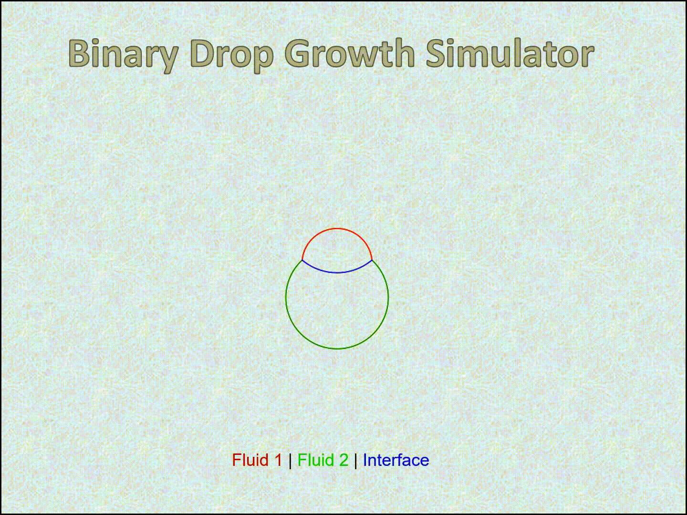

# BDGS: Binary Drop Growth Simulator

BDGS is a physics simulation package for simulating formation and growth of
a binary drop from proximal immiscible droplets.



### Dependencies
1. SymPy for Python \
Meurer, A., Smith, C.P., Paprocki M., et al. SymPy: symbolic computing in Python. PeerJ Computer Science 3:e103 (2017)
https://doi.org/10.7717/peerj-cs.103 \
Website: https://www.sympy.org

2. NumPy for Python \
Harris, C.R., Millman, K.J., van der Walt, S.J. et al. Array programming with
NumPy. Nature 585, 357–362 (2020). https://doi.org/10.1038/s41586-020-2649-2 \
Website: https://numpy.org

3. Matplotlib for Python \
Hunter, J. D. Matplotlib: A 2D graphics environment. Computing in Science &
Engineering vol. 9, no. 3, pp. 90-95 (2007).
https://doi.org/10.1109/MCSE.2007.55 \
Website: https://matplotlib.org/

4. tqdm for Python \
Costa-Luis, C., Larroque, S., Altendorf, K. et al. tqdm: A fast, Extensible Progress Bar for Python and CLI (v4.64.0). Zenodo (2022).
https://doi.org/10.5281/zenodo.6412640 \
Website: https://tqdm.github.io/

5. imageio for Python \
Klein, A., Wallkötter, S., Silvester, S. et al. imageio/imageio: v2.19.3 (v2.19.3). Zenodo (2022). https://doi.org/10.5281/zenodo.6592042 \
Website: https://imageio.readthedocs.io/

### Setup
Please refer to the websites for installation instructions of the above
dependencies.

### Usage
Step 0: Read the LaTeX/paper.pdf

Step 1: Nonequilibrium drop formed upon contact

        Nonequilibrium drop shapes refer to states of droplets when there are
        unbalanced forces at the interface(s) during initial contact. These
        simulations allow us to develop initial configuration of interfacing
        droplets that satisfy pressure-tension balance in the interface(s). The
        nonequilibrium module is used for this step.

Step 2: Equilibrium drop formed upon relaxation

        Equilibrium drop shapes are obtained when an initial nonequilibrium
        drop is relaxed such that the tension balance at the triple point is
        satisfied. The equilibrium module is used for this step.

Step 3: Drop shape evolution during relaxation

        Relaxation of drop occurs as a result of quasi-static reduction of
        unbalanced tension at the triple point. The relaxation module is used
        for this step.

Step 4: Drop growth

        Growth of drop occurs as there is influx/deposition to the droplets.
        The growth module is used for this step.


### Development

With following steps you can submit fixes for open issues or you can open a new
issue and submit fix for it:

```shell
# Fork this repository with the Fork button on top right
# Clone it to your local system
git clone https://github.com/<YourUserName>/BDGS.git
# Make a new branch with issue number (e.g. 1) as branch name
git checkout -b 1
# Create a new remote for this upstream repo
git remote add upstream https://github.com/modelsbox/BDGS
# Make your changes
...
# Stage them and commit with the issue tag (i.e. #1 for issue number 1)
git add .
git commit -m "fixes #1"
# Push it back to your repo
git push -u origin 1
# Click the Compare & pull request button at github.com/<YourUserName>/BDGS
# Click Create pull request to open a new pull request.
```

### Questions, Comments, Clarifications, Requests

Please use the Discussions tab. It'll be nice if you can introduce yourself to everyone in the Welcome thread.
